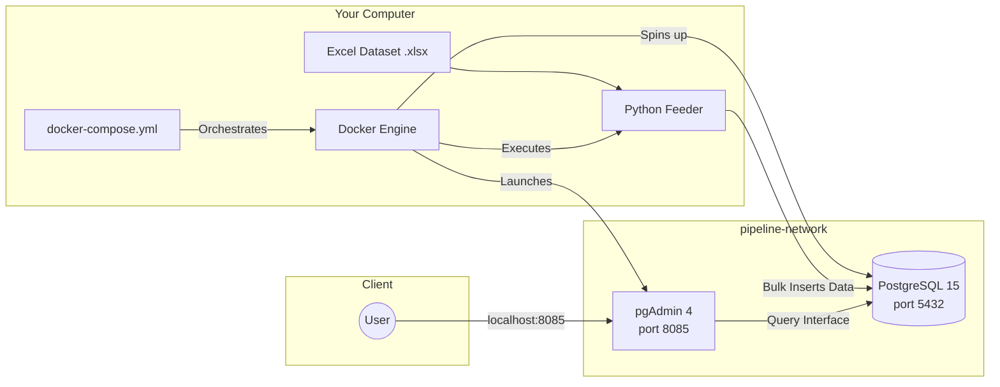

# Retail Data Ingestion Pipeline


> An automated **ETL (Extract, Transform, Load)** pipeline that processes over **1 million rows** of retail transaction data from an Excel file into a PostgreSQL database — fully containerized with Docker.

---

## Table of Contents

1. [Overview](#overview)
2. [Architecture](#architecture)
3. [Project Structure](#project-structure)
4. [Prerequisites](#prerequisites)
5. [Environment Variables](#environment-variables)
6. [Dockerfile Breakdown](#dockerfile-breakdown)
7. [Deployment Guide](#deployment-guide)
   - [Option A — Manual (docker run)](#option-a--manual-docker-run)
   - [Option B — Automated (docker-compose)](#option-b--automated-docker-compose)
8. [Verification & Inspection](#verification--inspection)
9. [How the Python Feeder Works](#how-the-python-feeder-works)
10. [Troubleshooting](#troubleshooting)
11. [Performance Notes](#performance-notes)

---

## Overview

This pipeline automates the ingestion of large-scale retail transaction data into a relational data warehouse. It is designed to be:

- **Portable** — runs identically on any machine with Docker installed.
- **Reproducible** — no manual environment setup required.
- **Observable** — includes pgAdmin for live querying and verification.

### Tech Stack

| Component | Technology | Version |
| :--- | :--- | :--- |
| Containerization | Docker | Latest |
| Data Warehouse | PostgreSQL | 15 |
| Ingestion Script | Python | 3.13-slim |
| Admin GUI | pgAdmin 4 | Latest |

---

## Architecture

The system is composed of three containers connected via a dedicated Docker bridge network (`pipeline-network`). This allows containers to communicate with each other using service names instead of IP addresses.



### Container Responsibilities

| Container | Image | Role |
| :--- | :--- | :--- |
| `postgres-db` | `postgres:15` | Stores and serves the retail data |
| `feeder` | Custom (`feeder-image`) | Reads Excel file, transforms, and loads data |
| `pgadmin` | `dpage/pgadmin4` | Web UI for querying and inspecting the database |

---

## Project Structure

```
retail-pipeline/
│
├── Dockerfile              # Defines the Python feeder image
├── docker-compose.yml      # Orchestrates all three containers
├── requirements.txt        # Python dependencies
├── onlinestore.py          # Main ETL script
└── online_retail.xlsx      # Source dataset (~50MB, 1M+ rows)
```

---

## Prerequisites

Ensure the following are installed on your machine before proceeding:

- [Docker Desktop](https://www.docker.com/products/docker-desktop/) (v20+) — includes Docker Compose
- At least **2GB of free RAM** for smooth container operation
- At least **1GB of free disk space** for the image and database

Verify your installation:

```bash
docker --version
docker compose version
```

---

## Environment Variables

These variables configure the PostgreSQL instance and the pgAdmin GUI. They are passed at runtime via `docker-compose.yml` or the `-e` flag.

| Variable | Default Value | Description |
| :--- | :--- | :--- |
| `POSTGRES_USER` | `root` | Database superuser username |
| `POSTGRES_PASSWORD` | `root` | Database superuser password |
| `POSTGRES_DB` | `online_retail` | Name of the database to create |
| `PGADMIN_DEFAULT_EMAIL` | `admin@admin.com` | pgAdmin login email |
| `PGADMIN_DEFAULT_PASSWORD` | `root` | pgAdmin login password |

> ⚠️ **Security Note:** The default credentials above are for local development only. Never use these in a production environment. Use Docker secrets or a `.env` file (added to `.gitignore`) for sensitive values.

---

## Dockerfile Breakdown

The custom Python feeder image is built from a slim base to keep the final size lean at approximately **702MB** (primarily driven by the pandas/SQLAlchemy dependency stack).

```dockerfile
FROM python:3.13-slim

WORKDIR /app

COPY requirements.txt .

RUN pip install --no-cache-dir -r requirements.txt

COPY . .

ENTRYPOINT ["python", "onlinestore.py"]
```

### Layer-by-Layer Explanation

| Instruction | Purpose |
| :--- | :--- |
| `FROM python:3.13-slim` | Lightweight Linux base image with Python pre-installed. Uses the `slim` variant to minimize size. |
| `WORKDIR /app` | Sets `/app` as the working directory for all subsequent commands. |
| `COPY requirements.txt .` | Copies only the dependency manifest first — this allows Docker to cache the `pip install` layer and skip it on rebuilds if dependencies haven't changed. |
| `RUN pip install --no-cache-dir -r requirements.txt` | Installs `pandas`, `sqlalchemy`, `psycopg2-binary`, `openpyxl`, etc. into the image layer. `--no-cache-dir` avoids storing the pip cache inside the image. |
| `COPY . .` | Copies the ETL script (`onlinestore.py`) and the Excel dataset into the image. This is intentionally done **after** `pip install` to preserve the cache layer. |
| `ENTRYPOINT` | Defines the default command that runs when the container starts — automatically executes `onlinestore.py`. |

> 💡 **Why copy the dataset into the image?** Embedding the dataset ensures the feeder is fully self-contained and reproducible. The trade-off is a larger image size. An alternative approach is to mount the file as a Docker volume at runtime to avoid rebuilding when the dataset changes.

---

## Deployment Guide

Choose one of the two methods below. **Option B (docker-compose) is recommended** as it automates all steps.

---

### Option A — Manual (docker run)

Follow these steps in order. Each container must be started before the next.

#### Step 1: Create the Network

```bash
docker network create pipeline-network
```

Creates a virtual bridge network so containers can resolve each other by name.

#### Step 2: Launch the Database

```bash
docker run -d \
  --name postgres-db \
  --network pipeline-network \
  -e POSTGRES_USER=root \
  -e POSTGRES_PASSWORD=root \
  -e POSTGRES_DB=online_retail \
  -p 5432:5432 \
  postgres:15
```

Wait 5–10 seconds for PostgreSQL to finish initializing before proceeding.

#### Step 3: Build & Run the Feeder

```bash
# Build the custom feeder image (only needed once, or when files change)
docker build -t feeder-image .

# Run the ingestion job
docker run -it --rm \
  --network pipeline-network \
  feeder-image \
  --pg_host postgres-db \
  --pg_user root \
  --pg_pass root \
  --pg_db online_retail
```

- `-it` — attaches your terminal so you can see live progress logs.
- `--rm` — automatically removes the container after ingestion completes.

#### Step 4: Launch pgAdmin

```bash
docker run -d \
  --name pgadmin \
  --network pipeline-network \
  -e PGADMIN_DEFAULT_EMAIL="admin@admin.com" \
  -e PGADMIN_DEFAULT_PASSWORD="root" \
  -p 8085:80 \
  dpage/pgadmin4
```

Access the UI at **http://localhost:8085**

---

### Option B — Automated (docker-compose)

This is the recommended approach. A single command replaces all four manual steps above.

**`docker-compose.yml`**

```yaml
version: "3.8"

services:
  postgres-db:
    image: postgres:15
    container_name: postgres-db
    environment:
      POSTGRES_USER: root
      POSTGRES_PASSWORD: root
      POSTGRES_DB: online_retail
    ports:
      - "5432:5432"
    networks:
      - pipeline-network
    healthcheck:
      test: ["CMD-SHELL", "pg_isready -U root -d online_retail"]
      interval: 5s
      timeout: 5s
      retries: 5

  feeder:
    build: .
    container_name: feeder
    depends_on:
      postgres-db:
        condition: service_healthy
    command:
      - --pg_host=postgres-db
      - --pg_user=root
      - --pg_pass=root
      - --pg_db=online_retail
    networks:
      - pipeline-network

  pgadmin:
    image: dpage/pgadmin4
    container_name: pgadmin
    environment:
      PGADMIN_DEFAULT_EMAIL: admin@admin.com
      PGADMIN_DEFAULT_PASSWORD: root
    ports:
      - "8085:80"
    depends_on:
      - postgres-db
    networks:
      - pipeline-network

networks:
  pipeline-network:
    driver: bridge
```

**Run everything with one command:**

```bash
docker compose up --build
```

> The `healthcheck` on `postgres-db` ensures the feeder container waits until PostgreSQL is genuinely ready to accept connections before starting — avoiding race condition errors.

**To stop and clean up:**

```bash
docker compose down
```

**To also remove the database volume:**

```bash
docker compose down -v
```

---

## Verification & Inspection

Once all containers are running, verify the data was loaded correctly.

### Via pgAdmin (GUI)

1. Open **http://localhost:8085** in your browser.
2. Log in with `admin@admin.com` / `root`.
3. Add a new server:
   - **Host:** `postgres-db`
   - **Port:** `5432`
   - **Username:** `root`
   - **Password:** `root`
4. Navigate to `online_retail` → `Schemas` → `Tables`.
5. Right-click your table → **View/Edit Data** to inspect rows.

### Via psql (CLI)

```bash
# Open a psql session inside the running postgres container
docker exec -it postgres-db psql -U root -d online_retail

# Check row count
SELECT COUNT(*) FROM transactions;

# Preview first 10 rows
SELECT * FROM transactions LIMIT 10;

# Exit
\q
```

### Check Feeder Logs

```bash
docker logs feeder
```

---

## How the Python Feeder Works

The `onlinestore.py` script follows a standard ETL pattern:

```
Excel File (.xlsx)
      │
      ▼
 [Extract]  — pandas reads the file in chunks to avoid memory overload
      │
      ▼
 [Transform] — cleans nulls, standardizes column names, casts data types
      │
      ▼
 [Load]      — SQLAlchemy streams data to PostgreSQL using bulk inserts
```

Key implementation details:

- **Chunked reading** — `pd.read_excel(..., chunksize=10000)` prevents loading the full 1M rows into memory at once.
- **Argument parsing** — connection parameters (`--pg_host`, `--pg_user`, etc.) are passed via `argparse`, making the container reusable across environments.
- **SQLAlchemy engine** — uses `psycopg2` under the hood for efficient batch inserts via `df.to_sql(..., method='multi')`.

---

## Troubleshooting

| Symptom | Likely Cause | Fix |
| :--- | :--- | :--- |
| `feeder` exits immediately with a connection error | PostgreSQL not ready yet | Add a `healthcheck` to `postgres-db` and use `depends_on: condition: service_healthy` |
| `docker build` fails on `FROM python:3.13-slim` | Wrong tag used (e.g. `3.13.10-slim`) | Use `python:3.13-slim` — patch versions aren't always on Docker Hub |
| pgAdmin shows blank page | Container still starting up | Wait 15–20 seconds and refresh |
| Row count is lower than expected | Null rows dropped during transform | Check feeder logs for dropped row warnings |
| Port `5432` already in use | Local PostgreSQL running on host | Stop local Postgres or change the host port mapping to `-p 5433:5432` |

---

## Performance Notes

- **Ingestion speed** depends on chunk size and available RAM. A `chunksize` of `10,000–50,000` rows is generally optimal for a dataset of this scale.
- The feeder image is **~702MB** due to pandas and its NumPy dependency. This is expected — use `--no-cache-dir` in `pip install` to avoid unnecessary bloat.
- For very large datasets (10M+ rows), consider switching from Excel to CSV or Parquet format, as `pd.read_excel` is significantly slower than `pd.read_csv`.
- PostgreSQL performance can be improved by disabling indexes during bulk load and re-enabling them after ingestion.

---

*Documentation generated for the Retail Data Ingestion Pipeline. For issues or contributions, open a pull request or file an issue in the project repository.*
